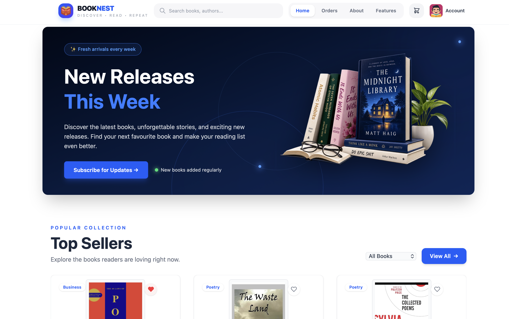
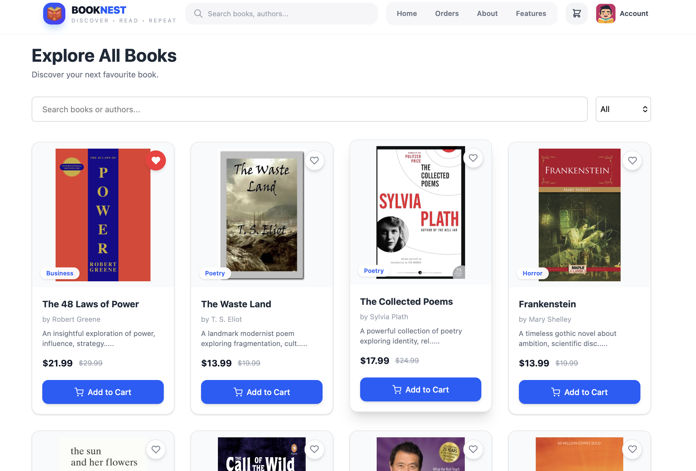
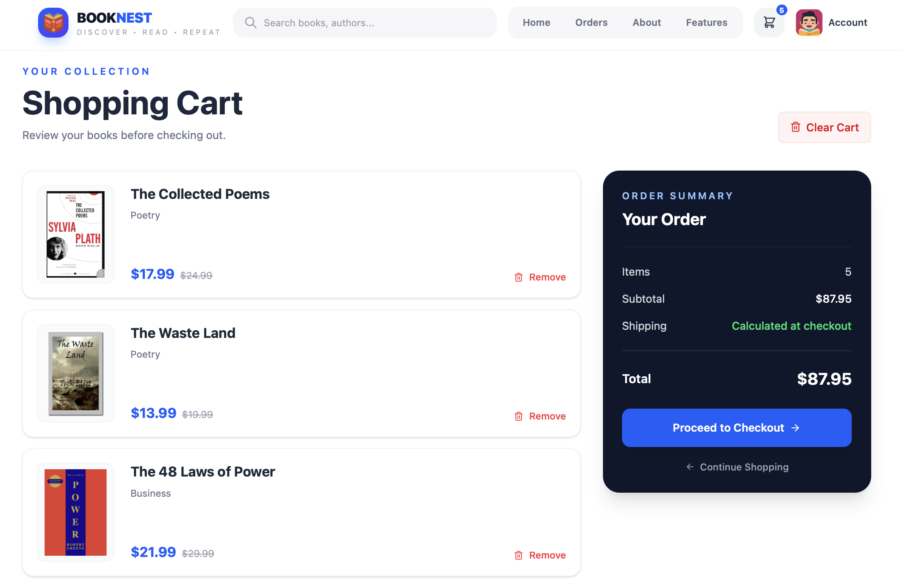
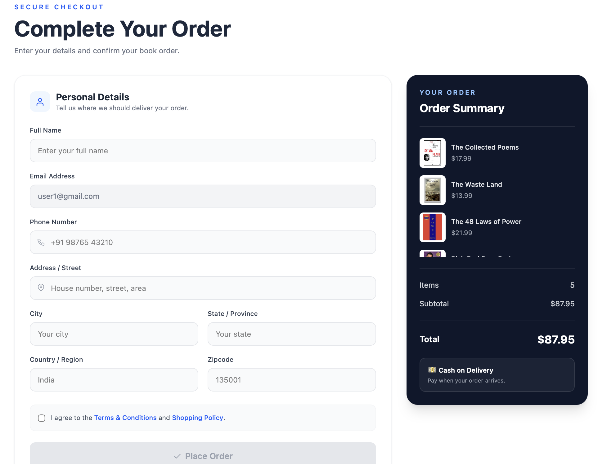
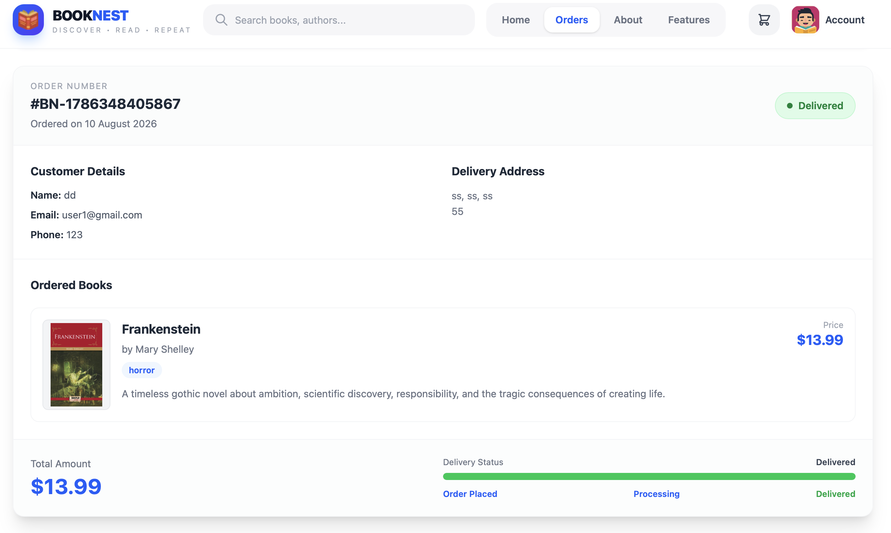
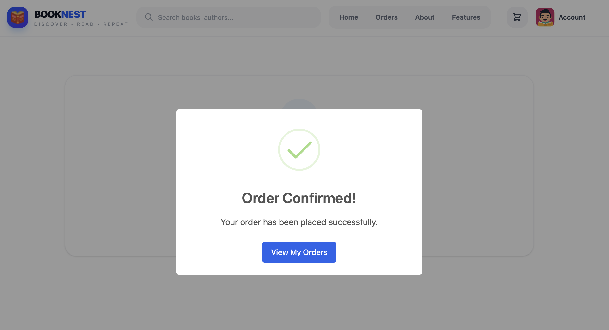
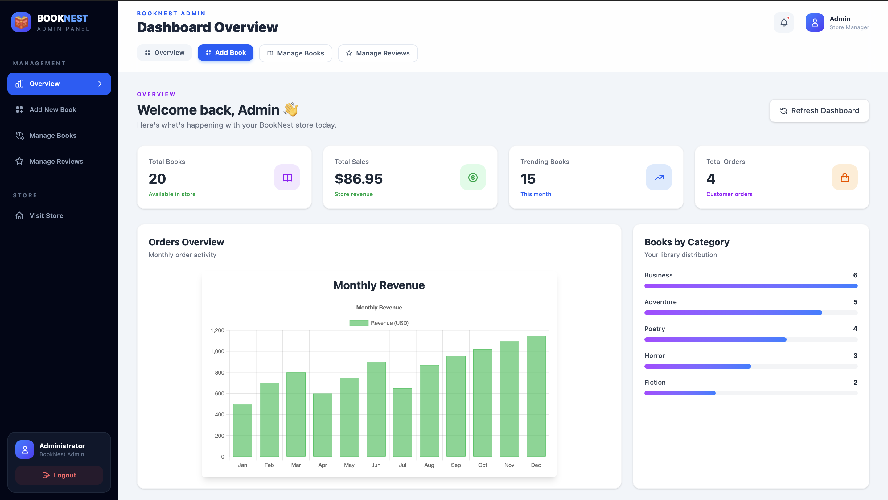
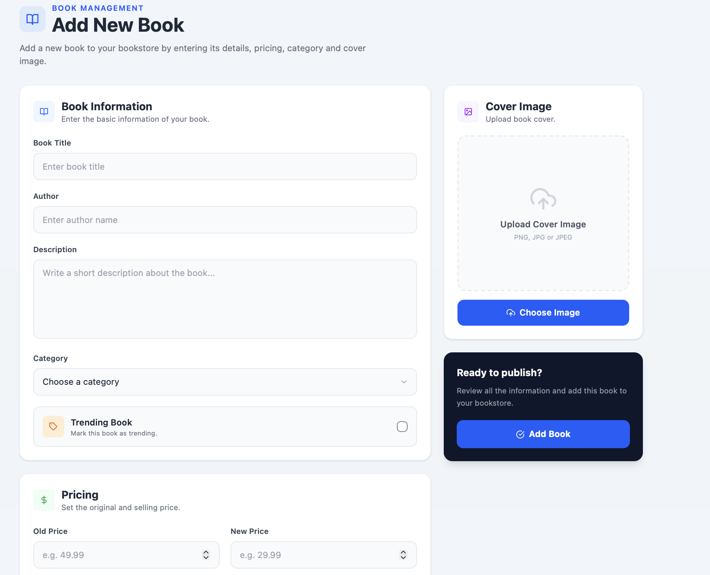
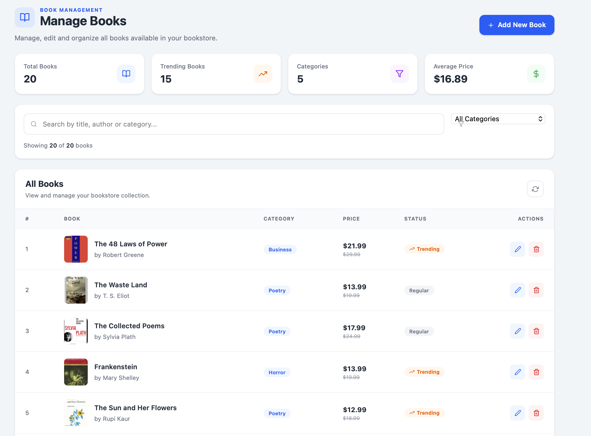

# 📚 BookNest — Online Bookstore

BookNest is a full-stack online bookstore web application built using the MERN stack.

The application allows users to browse books, search and filter books, view book details, add books to the shopping cart, place orders, and view their order history.

It also includes an admin panel for managing books, monitoring orders, and managing the bookstore.

---

## 🌐 Live Demo

**Frontend:** https://booknest-1-8aqo.onrender.com

**Backend API:** https://booknest-vvp0.onrender.com

---

## ✨ Features

### 👤 User Features

* User registration and login
* Firebase authentication
* Browse available books
* View individual book details
* Search and explore books by category
* Add books to cart
* Manage cart items
* Wishlist functionality
* Checkout and order placement
* View order history
* Submit and view book reviews
* Responsive user interface

### 👨‍💼 Admin Features

* Secure admin login
* Admin dashboard
* Add new books
* Upload book cover images
* Edit existing books
* Delete books
* Manage books
* Manage reviews
* View orders
* View store statistics and revenue information

---

## 🛠️ Tech Stack

### Frontend

* React.js
* Vite
* Tailwind CSS
* React Router
* Redux Toolkit
* RTK Query
* Axios
* Firebase Authentication
* Framer Motion

### Backend

* Node.js
* Express.js
* MongoDB
* Mongoose
* JWT Authentication
* Multer
* CORS

### Deployment & Services

* GitHub
* Render
* MongoDB Atlas
* Firebase

---

## 🏗️ Project Structure

```text
BookNest/
│
├── backend/
│   ├── src/
│   │   ├── books/
│   │   ├── orders/
│   │   ├── reviews/
│   │   ├── users/
│   │   ├── stats/
│   │   └── middleware/
│   │
│   ├── index.js
│   ├── package.json
│   └── .gitignore
│
├── frontend/
│   ├── public/
│   ├── src/
│   │   ├── components/
│   │   ├── pages/
│   │   ├── redux/
│   │   ├── routers/
│   │   ├── context/
│   │   ├── firebase/
│   │   └── utils/
│   │
│   ├── package.json
│   └── .gitignore
│
└── README.md
```

---

## 🔐 Authentication

BookNest uses **Firebase Authentication** for user authentication and **JWT-based authentication** for protected admin operations.

User authentication is handled through Firebase, while admin authentication is handled by the backend.

After successful admin login, the backend generates a JWT token which is stored on the client and used to access protected admin operations.

---

## 🗄️ Database

MongoDB is used as the primary database and Mongoose is used for data modeling and database operations.

MongoDB Atlas is used as the production database.

The application stores information such as:

* Users
* Books
* Orders
* Reviews

---

## 🖼️ Book Image Upload

## 📸 Screenshots

### 🏠 Home Page



### 📚 All Books



### 📖 Book Details


### 🛒 Shopping Cart



### 💳 Checkout



### 📦 Order Details



### ✅ Order Confirmation



### 📊 Admin Dashboard



### ➕ Admin Add New Book



### 🗂️ Admin Manage Books



---

## 🚀 Running the Project Locally

### 1. Clone the Repository

```bash
git clone https://github.com/Taranbeer-singh/booknest.git
cd booknest
```

### 2. Backend Setup

```bash
cd backend
npm install
npm run start
```

The backend runs locally on the configured port.

### 3. Frontend Setup

Open another terminal:

```bash
cd frontend
npm install
npm run dev
```

The frontend will be available through the Vite development server.

---

## 🔑 Environment Variables

### Backend

Create a `.env` file inside the `backend` folder:

```env
DB_URL=your_mongodb_connection_string
JWT_SECRET_KEY=your_jwt_secret
```

### Frontend

Create a `.env` file inside the `frontend` folder:

```env
VITE_API_KEY=your_firebase_api_key
VITE_AUTH_DOMAIN=your_firebase_auth_domain
VITE_PROJECT_ID=your_firebase_project_id
VITE_STORAGE_BUCKET=your_firebase_storage_bucket
VITE_MESSAGING_SENDERID=your_firebase_messaging_sender_id
VITE_APPID=your_firebase_app_id
```

> **Important:** Never commit real API keys, database credentials, JWT secrets, passwords, or other private credentials to GitHub.

---

## 📡 API Routes

The backend provides API routes for different parts of the application:

```text
/api/books
/api/orders
/api/auth
/api/reviews
```

Admin authentication is handled through:

```text
/api/auth/admin
```

---

## 📱 Responsive Design

The frontend is designed to provide a responsive experience across desktop and mobile screen sizes.

---

## 🚀 Deployment

The application is deployed using **Render**.

* Frontend: Render Static Site
* Backend: Render Web Service
* Database: MongoDB Atlas
* Authentication: Firebase

The source code is hosted on GitHub.

---

## 🔮 Future Improvements

Possible future improvements include:

* Online payment gateway integration
* Advanced book search and filtering
* Pagination
* Improved image storage using cloud storage
* Better product recommendations
* Performance optimization and code splitting
* Enhanced admin analytics
* Improved accessibility

---

## 👨‍💻 Author

**Taranbeer Singh**

BCA Graduate | Full-Stack Development Enthusiast

**GitHub:**
https://github.com/Taranbeer-singh

